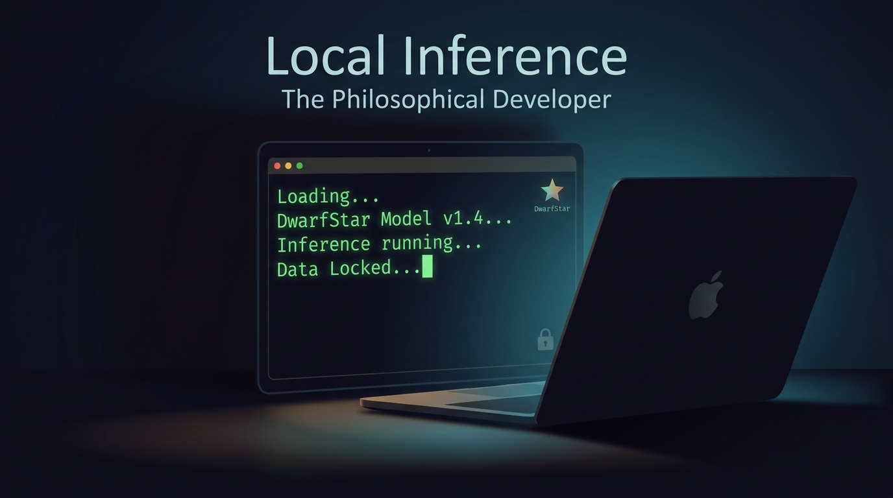

# Local Inference for Development: A Practical Experiment

I spent the last few days asking a simple question. Can real development work run on a local AI model, or is cloud infrastructure required?

The methodology was already established. Three TDD cycles per feature. Per-cycle commits on a feature branch. Squash merge into main. A trace tag to preserve the reasoning. The pipeline had been validated on cloud infrastructure. I wanted to know if it would work on my own machine.

## The Setup

I have an M2 Max Mac with 96GB of RAM. I used [DwarfStar](https://github.com/antirez/ds4), a local inference engine for DeepSeek V4 Flash written by antirez (the creator of Redis). It runs on Metal, Apple's GPU framework.

The model itself is 35GB. With SSD streaming, the routed experts live on disk and load on demand. Without that flag, the model would not even initialize. Memory is always the constraint, even with 96GB.

Server command:

```
./ds4-server ./gguf/model.gguf --ctx 200000 --ssd-streaming
```

## The Task

I gave my assistant the same task it had done on the cloud: implement the complete-task feature in a task tracker CLI from scratch. Three TDD cycles. RED first. Per-cycle commits. Squash merge. Trace tag. The full pipeline.

## The Results

The local model produced three clean cycles. No bundled commits. It followed the RED-first discipline strictly. When a test passed immediately because the behavior was already present from a prior cycle, it documented that honestly as a confirm-only cycle instead of forcing a fake RED-GREEN loop.

The trace tag on GitHub shows exactly what happened:

```
trace/complete-task:
  Cycle 3: done subcommand wires mark_done to CLI
  Cycle 2: error handling for out-of-bounds
  Cycle 1: mark task complete by index
```

Seven tests passed. Zero failures.

## The Numbers

- GPU utilization: 93%
- GPU temperature: 59 degrees Celsius
- GPU power: 14.3 watts
- Decoding speed: 8-11 tokens per second
- Session time: 21 minutes
- RAM used: 75GB out of 96GB

## What This Means

The pipeline is not tied to the cloud. It is not tied to any model. It is a process, and processes travel where they are needed.

Local inference is not about replacing the cloud. It is about having a choice. When the model runs on your machine, the code never leaves. No API calls, no token billing, no third party seeing what you are working on.

The discipline of writing tests first, committing per cycle, and tagging the trace works the same way regardless of where the model runs. The LSP guardrail catches bad code before it reaches the test runner. The trace tags make the reasoning auditable. All of that works on a laptop.

DeepSeek V4 Flash made this possible. I use their cloud service and I am really happy with it. It is insanely cheap and does the job I need. Running it locally on a laptop at 14 watts is just the next step in the same direction.

#Rust #TDD #LocalAI #DeepSeek #DeveloperTools #OpenSource