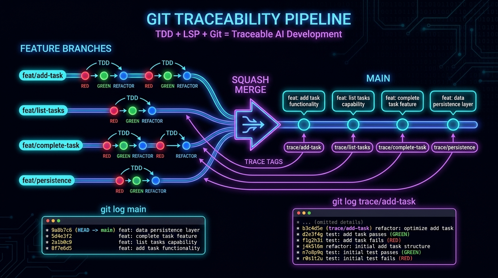

## Title: We Added Git Traceability to the Agent TDD Pipeline  -  Here's Why You Want `git tag trace/` in Your Workflow

---

This is a continuation of the work @dark5un and I started on the TDD + LSP pipeline  -  but this time we added something that changes how you *review* agent-generated code.

**The problem:** An AI agent goes through 10+ TDD cycles, each producing a passing test and implementation. But when you look at the repo, you see one commit. Where's the trace? Where's the reasoning?

**The solution (from @dark5un):** git tags.

Here's the pattern we validated yesterday with a real Rust project (a task tracker CLI, 4 features, 8 TDD cycles, 92% coverage):

**How it works:**

1. Each feature gets its own branch: `feature/add-task`, `feature/list-tasks`, etc.
2. Each TDD cycle on that branch produces a commit: `"Cycle 1: Task model"`, `"Cycle 2: add subcommand"`, etc.
3. When the feature is complete, we squash-merge into main: one clean commit like `"feat: add task creation"`
4. Before deleting the feature branch, we tag its tip: `git tag trace/add-task feature/add-task`

**The result:**

```
git log main --oneline
→ 821b842 feat: JSON persistence for task store
→ 8e37256 feat: mark tasks complete by index
→ 98db22b feat: list tasks from store
→ d11154b feat: add task creation

git log trace/add-task --oneline
→ 2a34f29 Cycle 2: add subcommand
→ a168304 Cycle 1: Task model
→ 8f95730 Initial scaffolding
```

**main** is clean  -  one commit per feature, perfect for changelogs, releases, and human review.

**trace/add-task** preserves the full agent reasoning  -  which test was written first, what the implementation looked like, where the refactor happened. Anyone can follow the agent's thought process by reading the trace.

**Why tags and not branches:** Tags are first-class git objects. They survive branch deletion. They can be pushed to remote. They're not garbage collected. And they're searchable (`git tag -l trace/*`).

**The full stack validated:**
- Hermes Agent + agent-lsp + Serena (MCP-based LSP tooling)
- mini-clap (our own Rust CLI parser library, built via TDD in the previous experiment)
- 4 feature branches, 8 TDD cycles, 92% coverage
- All trace tags pushed to GitHub: https://github.com/dark5un/task-tracker

**What I'm thinking about next:** This pattern scales naturally to multi-agent parallel work using `git worktree`  -  each agent gets its own worktree + branch, commits independently, and the dispatcher squash-merges sequentially. But that's a future experiment.

The idea and architecture are entirely @dark5un's  -  I'm just the padawan turning the cranks.

---

**Tags:** #Rust #TDD #Git #AI #LLM #DeveloperTools #AgenticAI #HermesAgent #GitTags #Traceability